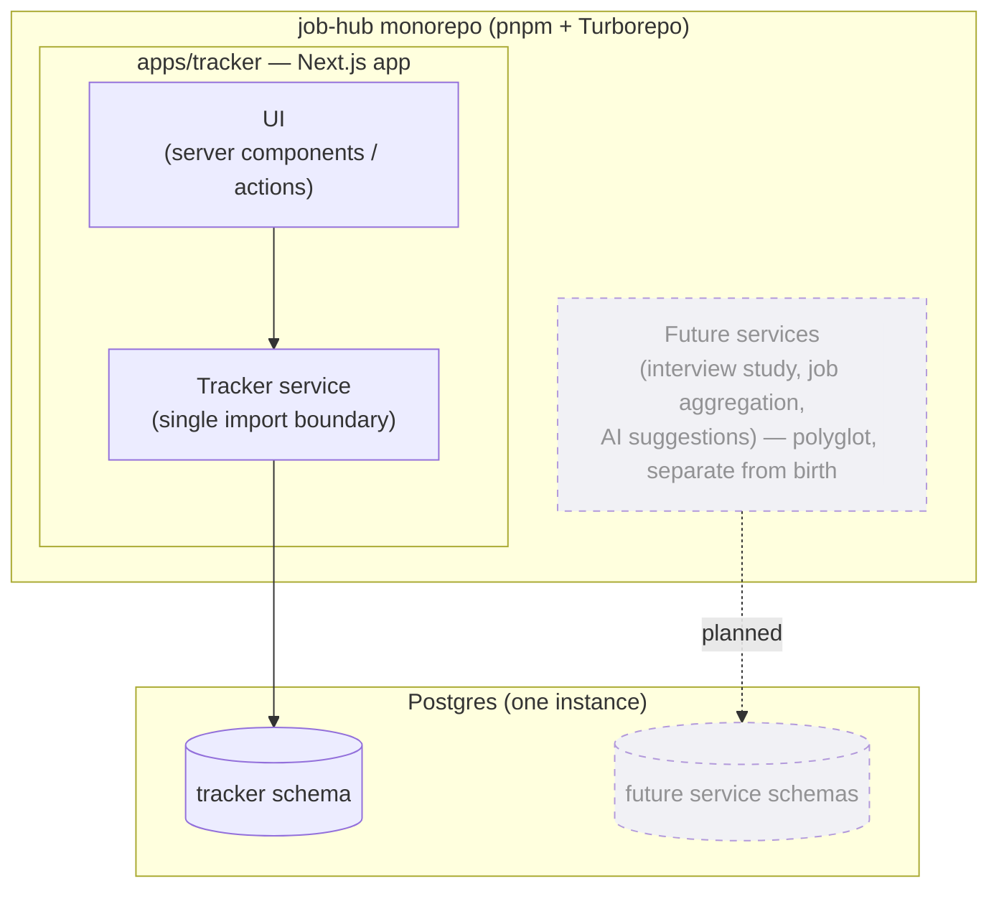
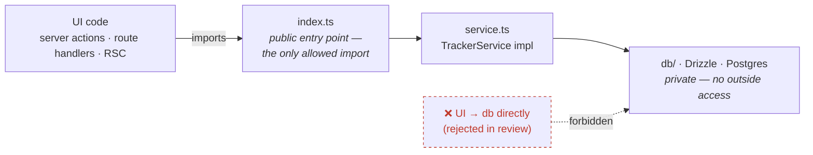
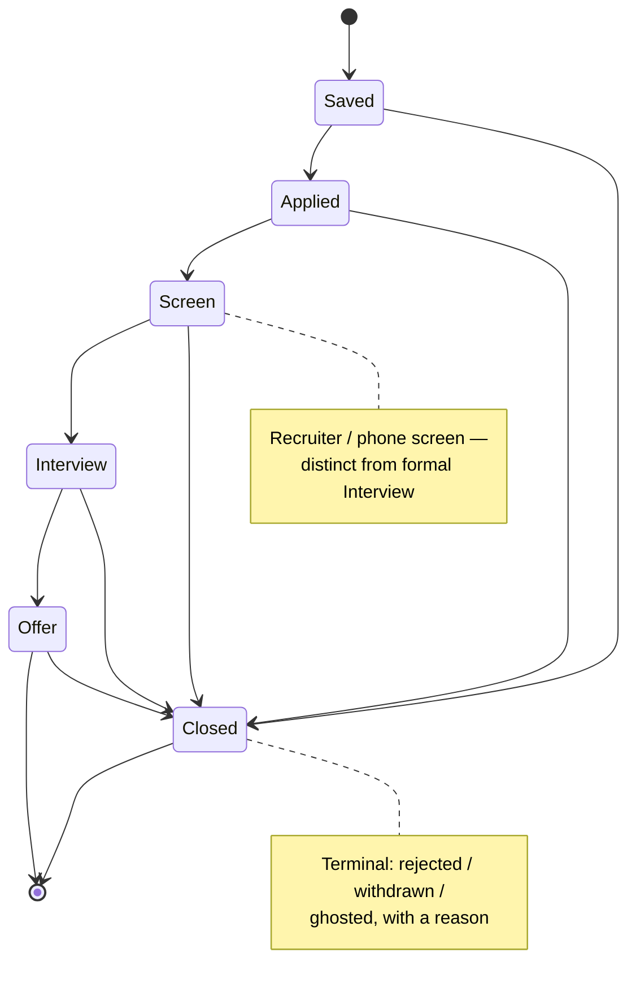

# job-hub

A personal, single-user (multi-user-*ready*) tool to run a job search like an engineering
project — track applications, study for interviews, and surface the next thing worth doing.
Built in the open as a portfolio piece: the interesting part isn't the feature count, it's
the **architecture and the decisions behind it**.

> **Status: early, deliberate.** The monorepo, CI, database, and the tracker's service
> boundary are scaffolded and wired end-to-end (a real Postgres round-trip proves the
> stack). Domain features are being built behind that boundary, issue by issue. See
> [Roadmap](#roadmap) for what's live vs. planned — this README is honest about the line.

---

## Why this exists

Most job-search trackers are a spreadsheet or a SaaS app you outgrow. `job-hub` is a
sandbox for building the tool I actually want **and** demonstrating how I make engineering
decisions: start with a useful wedge, keep boundaries clean enough that today's monolith
can become tomorrow's services, and write the rationale down.

The design philosophy in one line: **pragmatic tool first, portfolio piece as a
side effect.** Boring, proven, fast choices — documented.

## Highlights for the skim-reader

- **Domain-driven, decisions-first.** A settled [`CONTEXT.md`](CONTEXT.md) fixes the
  ubiquitous language, and five [ADRs](docs/adr/) record the architecture choices and their
  trade-offs — not just what, but *why*.
- **Extractable-by-design.** The Application Tracker lives inside the Next.js app today, but
  behind a single service interface so it can be pulled into its own service later **without
  touching the UI** ([ADR-0004](docs/adr/0004-tracker-colocated-extractable.md)).
- **Multi-user-ready from day one.** Every record is `Owner`-scoped even though there's one
  hardcoded owner today; deploying is what "turns on" real multi-user
  ([ADR-0001](docs/adr/0001-single-user-now-multi-user-ready.md)).
- **Schema-per-service data ownership.** One Postgres instance; the tracker owns a `tracker`
  schema and no service reaches into another's tables
  ([ADR-0003](docs/adr/0003-schema-per-service-data-ownership.md)).
- **CI from the first commit.** Typecheck, integration tests (against a real Postgres), and
  build run on every push.

## Tech stack

| Layer      | Choice                                             |
| ---------- | -------------------------------------------------- |
| Language   | TypeScript (Node ≥ 22)                             |
| Web app    | Next.js (App Router) + React 19                    |
| Data       | Postgres (Docker) + Drizzle ORM                    |
| Monorepo   | pnpm workspaces + Turborepo                        |
| Testing    | Vitest, incl. integration tests against Postgres   |
| CI         | GitHub Actions (typecheck · test · build)          |

Full rationale in [ADR-0005](docs/adr/0005-tech-stack.md).

---

## Architecture at a glance

### Monorepo, polyglot-ready

One repo, one Postgres instance. The tracker is a Next.js app today; future services can be
written in other languages, each in its own directory, each owning its own schema.



### The extractable service boundary

The UI may import the tracker **only** through one module entry point. Nothing outside the
service reaches into the database or Drizzle directly. That single seam is what lets the
tracker graduate into a standalone service later without a UI rewrite.



Today `TrackerService` is intentionally minimal — `checkConnection` / `countProbes`, a real
DB round-trip that proves the wiring. Domain methods (`createApplication`,
`listApplications`, dashboard queries) land behind this same interface, issue by issue.

---

## The domain

### The `Application` lifecycle

An **Application** is the central entity — one record per role being pursued. Its **Status**
moves through a deliberate pipeline. `Screen` is kept distinct from `Interview` on purpose:
it's the low-prep gatekeeping stage where many applications quietly die. `Closed` is
terminal and carries a **reason** (rejected / withdrawn / ghosted) and is reachable from any
active stage.



### Ubiquitous language (the short version)

These exact terms are used in code, issues, tests, and UI — the full glossary lives in
[`CONTEXT.md`](CONTEXT.md).

- **Application** — the central, `Owner`-scoped record; one per role.
- **Status** — pipeline position: `Saved → Applied → Screen → Interview → Offer → Closed`.
- **Activity log** — dated events on an Application ("recruiter call 8/12"). The timeline.
- **Next action** — the single thing owed, with an optional due date. The field that makes
  the tracker change behavior day to day.
- **Notes** — freeform, undated per-Application scratchpad, distinct from the Activity log.

---

## Roadmap

The **Application Tracker** is the wedge — useful standalone, and the spine other services
plug into.

**MVP (the wedge, in progress):**

- [x] Monorepo + CI + Postgres/Drizzle scaffold, proven end-to-end
- [x] Tracker service boundary established
- [ ] Create an Application via a manual form
- [ ] Table view — filter + sort by status and next-action date
- [ ] Detail view — edit fields, change Status, add Activity-log entries, Notes, Next action
- [ ] Dashboard — next actions due/overdue, stale applications, quick-add

**Planned services (hang off the tracker spine):**

- **Interview study** — flashcards / spaced repetition linked to a Company/Application.
- **Job search / aggregation** — pull and filter listings; a found listing becomes a tracked
  Application.
- **Suggested Actions (AI-driven)** — observes the pipeline and nudges on stalling
  applications and prep gaps; surfaces into the dashboard.

Deferred on purpose (boundaries above keep them open): hosting target, real auth, and the
inter-service communication pattern. Revisit when service #2 arrives.

---

## Getting started

Prerequisites: **Node ≥ 22**, **pnpm 11**, and **Docker** (for Postgres).

```bash
# 1. Install dependencies
pnpm install

# 2. Configure environment
cp .env.example .env      # then edit DATABASE_URL if needed

# 3. Start Postgres
pnpm db:up

# 4. Apply migrations
pnpm --filter @job-hub/tracker db:migrate

# 5. Run the app
pnpm dev
```

Common tasks:

```bash
pnpm test        # run tests (tracker integration tests hit a real Postgres)
pnpm typecheck   # typecheck all packages
pnpm build       # production build
pnpm db:down     # stop Postgres
```

## Repository layout

```
job-hub/
├── apps/
│   └── tracker/                 # Next.js app — the Application Tracker wedge
│       └── src/
│           ├── app/             # App Router UI
│           └── server/tracker/  # service boundary (index.ts) + db/ (private)
├── docs/
│   ├── adr/                     # architecture decision records (the "why")
│   └── agents/                  # conventions for AI-assisted development
├── CONTEXT.md                   # domain model + ubiquitous language (settled)
├── docker-compose.yml           # local Postgres
└── turbo.json                   # Turborepo pipeline
```

## Design records

The reasoning behind the structure lives in the ADRs — start here if you're evaluating how I
make architectural decisions:

- [ADR-0001 — Single-user now, multi-user-ready](docs/adr/0001-single-user-now-multi-user-ready.md)
- [ADR-0002 — Monorepo, polyglot microservices](docs/adr/0002-monorepo-polyglot-microservices.md)
- [ADR-0003 — Schema-per-service data ownership](docs/adr/0003-schema-per-service-data-ownership.md)
- [ADR-0004 — Tracker co-located but extractable](docs/adr/0004-tracker-colocated-extractable.md)
- [ADR-0005 — Tech stack](docs/adr/0005-tech-stack.md)
